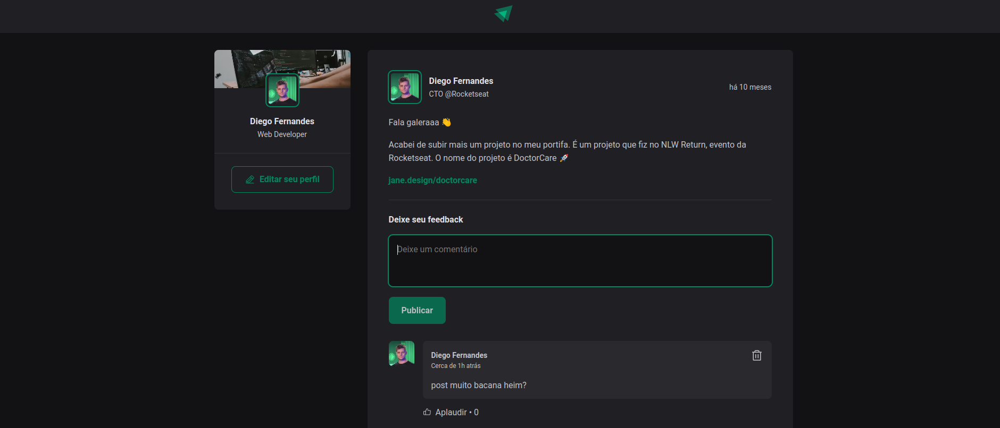

<h1 align="center">FEED</h1>

## Introdução

Aplicação para visualização de postagens de conteúdo (blog).

Projeto desenvolvido durante o módulo 1 do curso de Reactjs ignite 2022 ministrado pela Rocketseat, para aplicação dos conceitos básicos de Reactjs.

<div align="center">
  
</div>

## Requisitos

- Nodejs
- npm

## Tecnologias

- Vite (Reactjs)
- typescript
- Module CSS
- date-fns
- phosphor-react

## Instalação

```sh
# Fazer o clone do projeto em uma máquina local
git clone https://github.com/marciovz/feed-reactjs-ignite2022.git
```

```sh
# Acessa a pasta do projeto
cd feed-reactjs-ignite2022
```

```sh
# Rodar a instalação das dependências do projeto
npm install
```

## Rodando a aplicação

Abrir o emulador ou conectar um dispositivo para rodar a aplicação

```sh
# Rodar a aplicação localmente
npm run dev
```

Abrir a aplicação no navegador no endereço http://localhost:3000


## Melhorias

- Aplicar testes
- Implementar o cadastro de usuário
- fake api com posts
